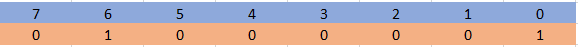
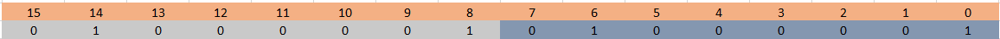
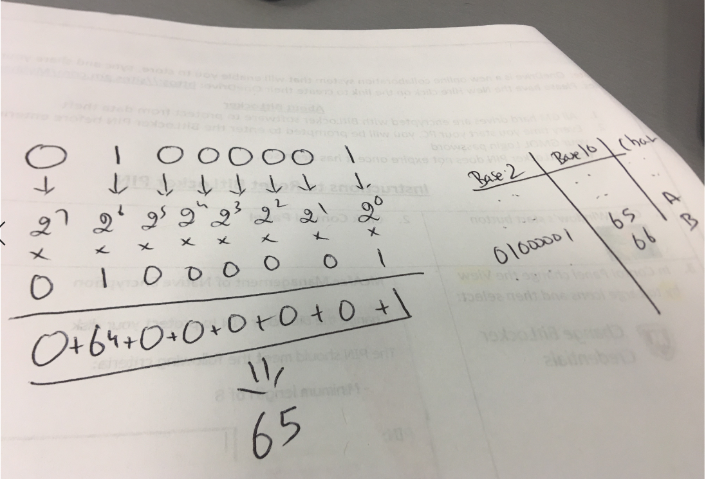
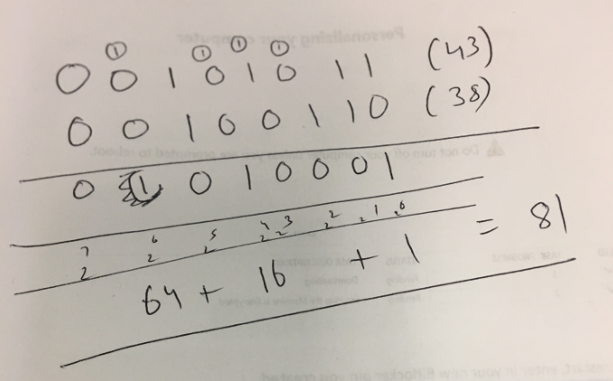
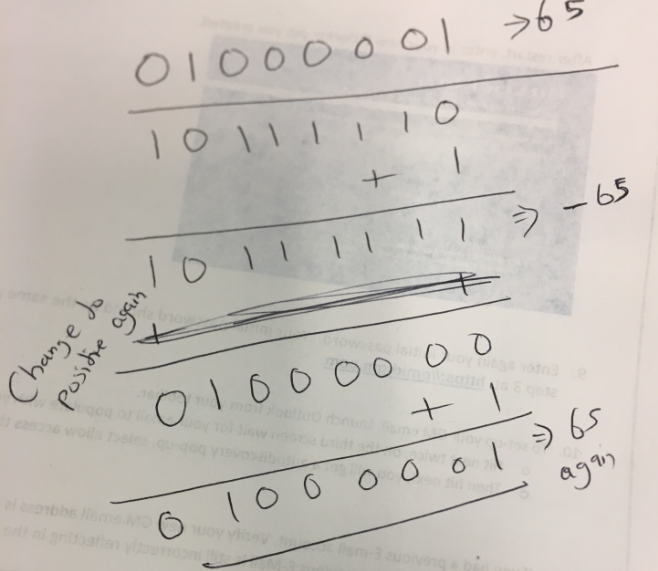
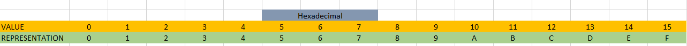
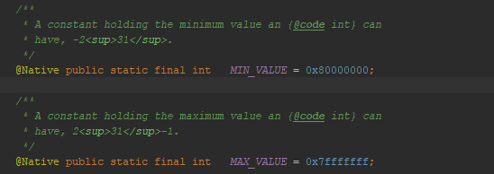

# Byte,Bits,Hex

1 character is 1 byte

1000 Characters = 1KB 

1 million Characters = 1 MB

1 billion characters = 1 GB

1 trillion characters = 1 TB

Keep powering 2 with more 2s and when the result crosses the 1000, like it happens @  1024 but round it to 1000 and make in 1 KB

we cross a million @ the value 1,048,576 but we round of to 1,000,000 and call it as 1MB

# Then what is a BIT ?

0 or 1 (not going to eloborate)

## Story

- Someone prepares a list of characters a computer needs to represent,
    - Lets say,
        - Lower case alphas - 26
        - Upper Case Alphas  -26
        - Digits 0-9 - 10
        - Bunch of special chars ,.@#$%^& etc

    They arrived @ 128 characters and then added 128 more ( extended library - not important for the story) . So we got the 256 character based ASCII table.

- If we need to represent only 2 characters using 0s and 1s , we just need 2 bits 0,1
- If we need to represent only 4 characters using 0s and 1s we need pair of bits like 00,01,10,11
- But we have 256, happens to be 2^8 = 256
- So for representing these 256 characters we need 8 digit number combination of 0s and 1s starting from 00000000 to 11111111.
- So we need,
    - 1 byte to store a character
    - 8 bit to represent a character
    - So we can say 1 byte == 8 bits

# What happens when you press a key:

To start the discussion we need to know that A is represented as `01000001` and this is universal.

- So when you type a character in your keyboard
- It will look into its ASCII table and send electric impulses to the computer as `01000001` even better `off-on-off-off-off-off-off-on`
- The computer will then store these `8 bits` sequence in a memory location as a `byte`
- So the memory location basically holds `01000001` instead of A

## ASCII table is an integral part of the computer

## 32 bit or 64 bit computer ? What again ?

So this is how it goes, we are still holding to the fact we arrived at.

 `1 byte == 1 character == 8 bit` 

Now computer processors are implementations that can access the memory of the computer.

- If a processor can access 1 byte at a time its called 1 word of memory computer or 8 bit computer
- If a processor can access 2 bytes at a time its called 2 word of memory computer or 16 bit computer
- If a processor can access 3 bytes at a time its called 3 word of memory  computer or 24 bit computer
- If a processor can access `4` bytes at a time its called 4 word of memory computer or `32` bit computer
- If a processor can access 5 bytes at a time its called 5 word of memory computer or 24 bit computer
- .....
- .....
- If a processor can access `8` bytes at a time its called 8 word of memory computer or `64` bit computer

So if can processor can access 4 character/bytes at a time its a 32 bit computer and 8 character/bytes at a times its called 64 bit computer.

## LSB or MSB ? Order of the bits

Least Significant Bit or Lower Order Bit

Most Significant Bit or Higher Order Bit

This represents A 

0 ( right most ) which holds 1 in this case is the LSB

7 ( left most) which holds 0 in this case is the MSB

This represents AA

0 ( right most ) which holds 1 in this case is the LSB

7 ( left most) which holds 0 in this case is the MSB

## ASCII A is 65 and how computer knows this ?

01000001 `base 2` number is equals to 65 `base 10` number

How Base 2 becomes Base 10 becomes a Character

The maximum base 10 number a 8 bit binary can represent in 255

2^7 + 2^6 + 2 ^5 + .......+ 2^1+2^0 = 128+64+32+16+8+4+2+1 = 255

## Computers can only ADD and convert themselves to Negative.

- They cannot do other arithmetic operations but using this adding and convert to negative capability we achieve the same.
- Binary addition rules,
    - 0+0 = 0
    - 0+1 = 1
    - 1+0 = 1
    - 1+1 = 10 ( in this case 1 is a carry over to the next step )
- Example to add 43 and 38 ( this involves carry over )

     

    

- The computer doesn't know if its A ( character) or binary number. If you invoke Addition it will just add.
- To `Multiply` it will keep adding those many times
- To `Divide` it will keep subtracting until 0 and returns how many times it subtracted
- To `Subtract` it will 13 from 7 it will convert 7 into -7 and then add 13 and -7 and you will get 6.
- If you exceed the bit limit you will get a ZERO ( 10000000 (128) + 10000000(128) = 256 ) but 255 is the limit hence 0. This is 8 bit addition. This condition is called `false positive`

## Convert Binary to its Negative: In other words derive the 2s complement

2 steps:

- Reverse or Flip the digits where 0 becomes 1 and 1 becomes 0
- Then Add 1.

Converting to Positive is the `same` you will `NOT SUBTRACT` you still `ADD` ( don't ask me why )

The -65 is not 191 because in this context we are deliberately converting a positive to negative

## Signed or Unsigned Number:

In the above image 10111111 when converted to decimal is actually represents 191 instead of -65 so how do we know ?

So it depends on the context and assumption. If the Binary number is assumed to be SIGNED then if the `MSB or HOB is 1`  then its `NEGATIVE` , if unsigned the same will be a large Positive number. It all depends on how the program uses them.

## int32 or int64

Its all about space. Int32 takes 4 bytes and int64 takes 8 bytes so larger number can be stored.

In Latin `Integer` means `Whole Number`

So for Java `integer` it holds `signed` numbers and it can hold `32 bit` so the maximum it can hold is `2^32` which is `4,294,967,296` but to accommodate negatives the range has been set as `-2,147,483,648` to`+2,147,483,648`   but if its `unsigned` then range would have been `0` to `4,294,967,296`

## Hexadecimal Number:

Integer Class

80000000 = -2,147,483,648

## Java Bitwise Operators:

[https://www.geeksforgeeks.org/bitwise-operators-in-java/](https://www.geeksforgeeks.org/bitwise-operators-in-java/)

[http://www.java2s.com/Book/Java/Language-Basics/Bitwise_Operators.htm](http://www.java2s.com/Book/Java/Language-Basics/Bitwise_Operators.htm)

## Facts:

- We can assign HEX to `int` like `0x.....`
- We can assign Binary to `int` like `0b.....`
    - We can assign char to `int` like `'D'` and print it to get a Number
